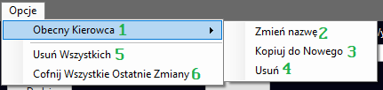
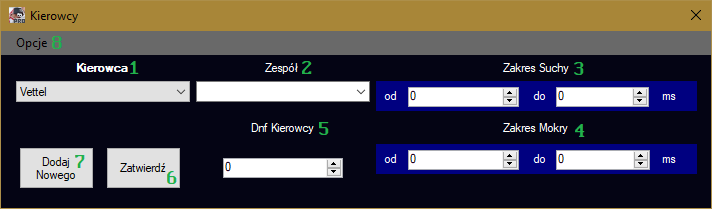
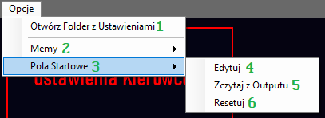

# Usage
In order to use the program, It's recommended to know the Polish language, as the entire user interface is written in Polish. For those, that don't know it, I'll try to explain stuff anyways.

Upon executing the program, you'll see this view:

This is the main menu of the program, let's examine it a little bit:

1. *Team Settings*
2. *Racer Settings*
3. *RACE!!!*
4. This is the place where the final results of the race will be displayed
5. *Turn off the DNF* - When checked, DNFs (Events, that cause specific racers not to finish the race) will not happen
6. *Rain*
7. The place to describe how many loops do you want in the race
8. After the race is finished, you can press this button to export the results in form of a CSV file (values are separated with `;` and the CSV is not UTF-8 encoded, because excel asked me to)
9. *Options* - There isn't anything that important in here, we'll come back here later.

Firstly, we need to define our Teams, let's click the `Teams Settings` button, if you didn't set up the Teams before (you probably didn't at this point) a prompt for a new team name will show up. Just write sth and you'll have a team config menu:

1. *Team* - you use this combobox to select what team do you want to modify
2. *Achievements* - A time value provided in Seconds (accepts fractions). What are you supposed to type there? How to come up with the value? I don't know, I wasn't the one who organised F1 roleplays nor the one who used this program, I only designed it. I guess type here something that you find apropriate. This is the case with most values you need to provide - just come up with something!
3. *Endurance* - A value, that provides a likeliness of a DNF happening. `0` will mean, that DNF'll never happen, 1 - DNF'll always happen, then inceasing the value will reduce the likeliness of DNFing.
4. *Confirm* - when you change the atributes of a team, make sure to press this button before proceding to switch to another team.
5. *Add new*
6. *Options* - Additional controls. Let's have a look a them:

Here are the explanations:
1. *Current Racer* - there's a really obvious oversight in the name, but this option contains buttons that directly affect the current selected team: 
2. *Change name*
3. *Copy to New* - this will prompt you to create new team, and the new team will have the same attribues as the team, that was opened when the button was clicked
4. *Delete*
5. *Delete All* - Deletes all teams
6. *Undo all the recent changes* - undos all the changes, that were done since the window was opened.

After you're done with teams close the teams window and then let's go to the Racer Settings! Similarily to Teams settings, the program will firstly prompt you to Provide a name for the first Racer. after you provide it, you'll be greeted with a window, that's very similar to the Team settings window:

1. *Racer* - the current racer you want to modify
2. *Team* - select a team where the driver belongs to.
3. *Dry Range* - range of times provided in miliseconds. It essentially describes the speed of the racer.
4. *Wet Range* - range when rain
5. *Racer's DNF* - the same thing as the *Endurance* fielt from Team Settings
6. *Confirm*
7. *Add new*
8. *Options* - it's exactly the same as in Team Settings (except it also has *Import from MetaData.txt* button, that's there for backward-compatibility with legacy 2021 versions, that aren't available publicly)

After you're done with Racers, we can finally start the Race! Close the Racer Settings window, set the amount of laps and click the *Race!!!* button. It'll display some Popups, that will alert you about DNFs that hapened during the race. When the race is finished, you'll see the final results. The program is also going to generate a `Wyniki.log` file (or if the file exists, it will add content to the bottom of the file), which contains a detailed info about the entire race. you can now export the final results as a CSV. 

Only thing we have left to discuss are the options in the main menu:

1. *Open the Folder with Settings*
2. *Memes* - contains a buttons, that play sound effects
3. *Pole Positions* - those are settings related to Pole positions
4. *Edit* - manually edit the pole position stuff
5. *Read from Output* - Set the pole position stuff based on the final results of the last race
6. *Reset* - removes all the poleposition data

I think I've explained everything here. If you have any questions, feel free to contact me via discord I guess.