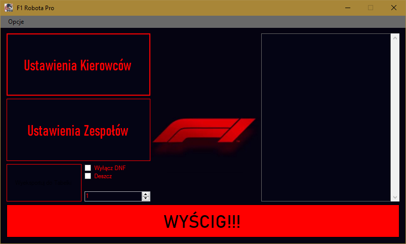
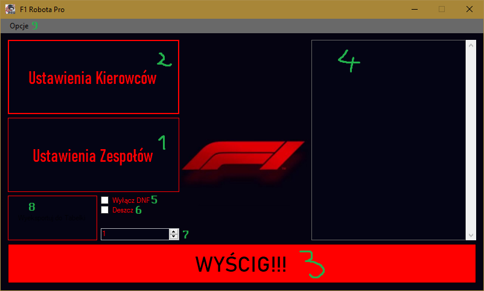
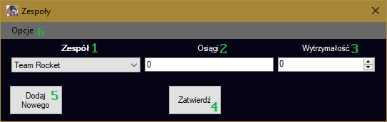

# Usage
In order to use the program, It's recommended to know the Polish language, as the entire user interface is written in Polish. For those, that don't know it, I'll try to explain stuff anyways.

Upon executing the program, you'll see this view:

This is the main menu of the program, let's examine it a little bit:

1. *Team Settings*
2. *Racer Settings*
3. *RACE!!!*
4. This is the place where the final results of the race will be displayed
5. *Turn off the DNF* - When checked, DNFs (Events, that cause specific racers not to finish the race) will not happen
6. *Rain*
7. The place to describe how many loops do you want in the race
8. After the race is finished, you can press this button to export the results in form of a CSV file (values are separated with `;` and the CSV is not UTF-8 encoded, because excel asked me to)
9. *Options* - There isn't anything that important in here, we'll come back here later.

Firstly, we need to define our Teams, let's click the `Teams Settings` button, if you didn't set up the Teams before (you probably didn't at this point) a prompt for a new team name will show up. Just write sth and you'll have a team config menu:

1. *Team* - you use this combobox to select what team do you want to modify
2. *Achievements* - A time value provided in Seconds (accepts fractions). What are you supposed to type there? How to come up with the value? I don't know, I wasn't the one who organised F1 roleplays nor the one who used this program, I only designed it. I guess type here something that you find apropriate. This is the case with most values you need to provide - just come up with something!
3. *Endurance*